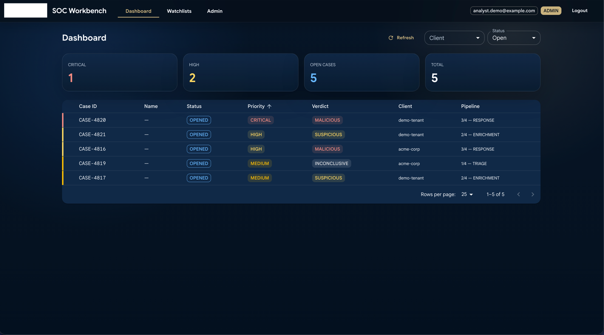
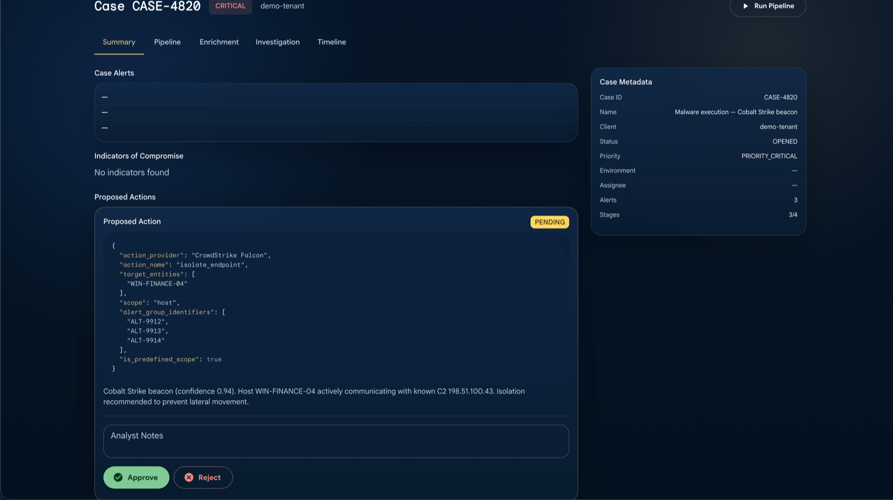
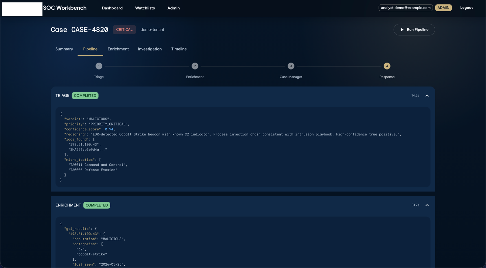
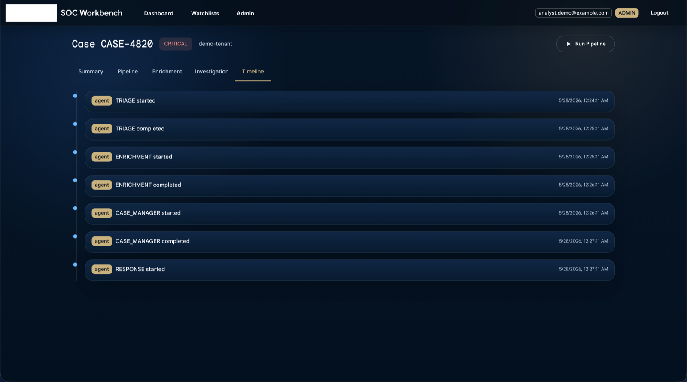
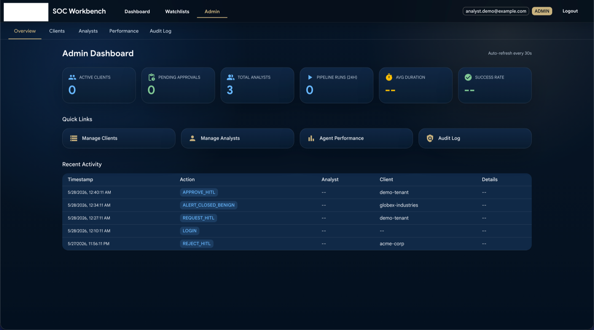
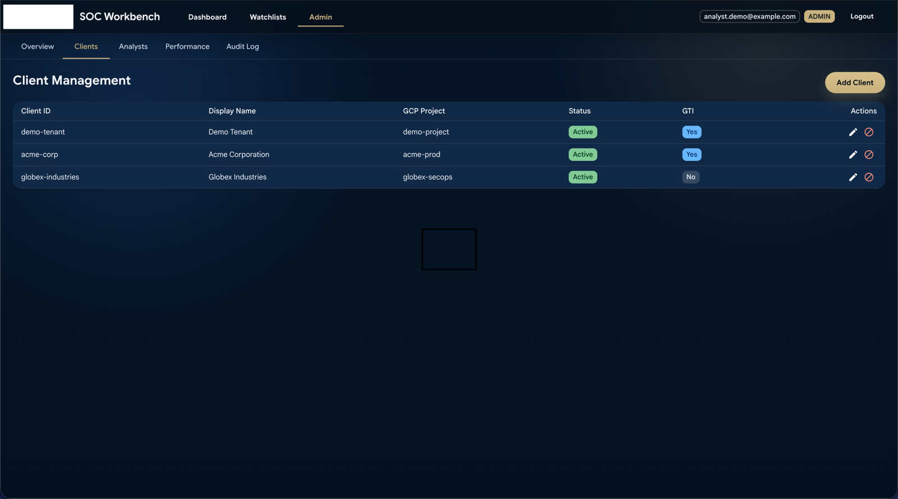
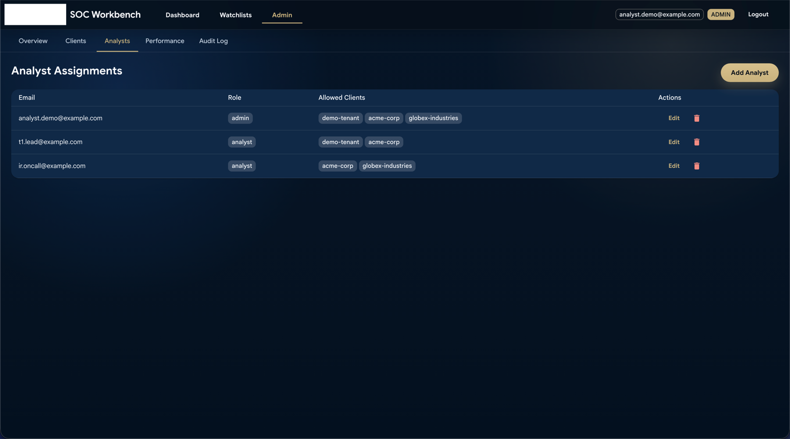
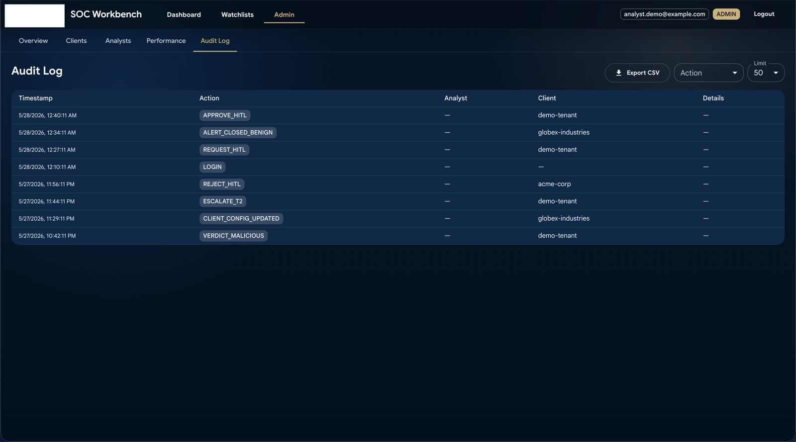

# Agentic SOC

> A multi-agent system that replaces Tier-1 SOC analysts — built on Google ADK + Gemini, with first-class interpretability, human-in-the-loop safety, and cost guardrails.

[](LICENSE)
[](https://www.python.org/downloads/)
[](https://github.com/google/adk-python)

---

## Why this exists

LLM agents in security operations face a triad of hard problems:

1. **Interpretability** — Why did the agent decide this alert is benign? Black-box LLM reasoning is unacceptable when an alert is missed.
2. **Safety** — Containment actions (isolate endpoint, block IP) are irreversible. An autonomous mistake costs more than the analyst it replaces.
3. **Cost** — Naive multi-agent loops with frontier models burn $100s per alert. Production-viable agentic SOCs need hard cost guards.

This project is a working answer to all three, deployed end-to-end on Google Cloud against real Chronicle SecOps tenants.

## What it does

Replaces the **Tier-1 SOC analyst loop** — alert triage → enrichment → case management → response — with autonomous agents that:

- Read alerts from Chronicle SIEM/SOAR via Model Context Protocol (MCP)
- Enrich IoCs with Google Threat Intelligence (file/IP/domain/URL reputation, MITRE mapping)
- Make verdict decisions (`MALICIOUS | SUSPICIOUS | BENIGN | INCONCLUSIVE`) with explicit `confidence_score`
- Close false positives autonomously, escalate confirmed malicious, request human approval for irreversible actions
- Record every intermediate decision to a "Glass Box" log for post-hoc review

## Architecture

The system is structured in three functional layers, each with a clear responsibility:

```
LAYER 3 — Reasoning (Google ADK + Vertex AI Agent Engine)
  Orchestrator (Gemini 2.5 Pro)
  ├── Triage      (Gemini 2.5 Flash)  — 19 tools, verdict + priority + confidence_score
  ├── Enrichment  (Gemini 2.5 Flash)  — 21 or 30 tools (Chronicle only / Chronicle+GTI)
  ├── Case Mgr    (Gemini 2.5 Flash)  — 11 tools, SOAR lifecycle
  └── Response    (Gemini 2.5 Flash)  —  7 tools, HITL-guarded
                  │ MCP Protocol over HTTP Streamable + SSE
                  ▼
LAYER 2 — Integration & Security (Cloud Run · FastAPI)
  MCP Gateway · Model Armor · SA Impersonation · Circuit Breaker · Validation · OpenTelemetry
  /mcp/{client_id}                                                  /gti/{client_id}
                  │ SA Impersonation + x-goog-user-project (tenant isolation)
                  ▼
LAYER 1 — Data & Detection (Google SecOps + GTI + Firestore)
  Chronicle SIEM (UDM + YARA-L, 64 MCP tools) · Chronicle SOAR · GTI / VirusTotal (gti-mcp)
  Firestore (hitl_approvals, workflow_stages, dedup) · Secret Manager (per-tenant SA)
```

The Orchestrator runs the four sub-agents through a sequential pipeline `1 → 2 → 3 → 4` (instead of ADK's native `transfer_to_agent` delegation) to retain explicit control of the flow, persist typed contracts between stages to the Glass Box, and handle errors per stage without losing context. The Response Agent enforces mandatory Human-in-the-Loop via `_hitl_guard` (a `before_tool_callback` registered on `execute_manual_action`).

**Front-end:** SOC Workbench (FastAPI + React/Vite/shadcn) for HITL approval, pipeline visualization, and case inspection — see screenshots below.

## What's novel here

This repo isn't just "LangChain + a SIEM." Three design choices make it interesting to AI safety / agent research:

### 1. ICM — Interpretable Context Methodology

Three-pillar discipline for keeping multi-agent reasoning legible:

- **Stage Contracts** — runbooks (markdown) declare the input/output/tools each stage may use. Loaded by `agents/runbook_loader.py` at runtime, not baked into prompts.
- **Tool Scoping** — `agents/tool_catalog.py` is the single source of truth for which MCP tools each agent can call. Triage gets 19 tools, Response gets 7. No agent has "all of Chronicle."
- **Glass Box** — `agents/stage_tracker.py` writes every intermediate agent output to Firestore (`workflow_stages` collection, TTL 30d). Every verdict has a full audit trail.

Token reduction vs naive prompt-stuffing: ~40K → 2–8K (5–20×). See `runbooks/tactical/` for live examples.

### 2. HITL as a code-enforced invariant

`before_tool_callback` (`_hitl_guard`) blocks `execute_manual_action` unless `approval_status ∈ {APPROVED, MODIFIED}`. Not a prompt instruction — a callback. Two-pass execution: agent submits request → analyst decides in Workbench → callback re-runs with decision. Approvals expire after `hitl_timeout_minutes` (default 30).

### 3. Five cost guards

1. `_llm_call_guard` — max 25 LLM calls per pipeline (kills runaway loops)
2. 120s hard timeout per agent
3. No-retry directive in prompts (prevents Gemini self-retry inflation)
4. IoC enrichment capped at 10 per alert
5. Flash (not Pro) for the HITL execution path

Result: median alert processing cost ~$0.08 vs >$1 unguarded.

## Multi-tenancy (MSSP design)

One partner GCP project serves N client Chronicle tenants. Per-request routing via Service Account Impersonation + `x-goog-user-project`. Gateway force-overrides `projectId`/`customerId`/`region`/`environmentId` from `ClientConfig` so a misbehaving agent cannot cross tenants.

## Methodology

The architecture and validation follow the **Design Science Research (DSR)** framework (Hevner et al.), organized in six phases that map directly to the project artifacts:

| DSR Activity | Project Phase | Artifact |
|---|---|---|
| Problem identification | Assessment of the current SOC state | Operational analysis |
| Definition of objectives | Functional + non-functional requirements | 8 FRs, 7 NFRs |
| Design & development | Three-layer multi-agent architecture | This repository |
| Demonstration | Validation against a real NFR tenant | 600+ live cases |
| Evaluation | Test suite, ADK evals, security audit | 407 tests, 47 evals, 22 findings remediated |
| Communication | Technical report and public release | This README |

### Requirements summary

The system was built against eight functional (FR) and seven non-functional (NFR) requirements. The non-negotiable ones:

- **FR-02** — Triage emits a structured verdict (`MALICIOUS | SUSPICIOUS | BENIGN | INCONCLUSIVE`) with `confidence_score ∈ [0.0, 1.0]`.
- **FR-05** — All response (containment) actions require mandatory human approval.
- **FR-06** — All intermediate agent outputs are logged for full auditability (Glass Box).
- **FR-08** — The architecture supports multiple Chronicle tenants with data isolation and dynamic routing.
- **NFR-01** — Each agent operates exclusively with the MCP tools assigned to its functional domain (least privilege).
- **NFR-02** — Destructive actions (isolation, blocking, rule modification) require mandatory human approval, enforced at the code level.
- **NFR-03** — Complete processing pipeline must not exceed 120 seconds under normal conditions.
- **NFR-06** — The system must protect against prompt injection via Model Armor at the Gateway.
- **NFR-07** — Observability must cover distributed traceability (OpenTelemetry) with correlation between Cloud Trace and Glass Box.

## Project structure

```
agentic-soc/
├── agents/              # ADK agents + ICM machinery (tool_catalog, runbook_loader, stage_tracker)
├── runbooks/            # Stage Contracts (markdown) + personas + IRPs
├── proxy/mcp_gateway/   # Multi-tenant MCP proxy (FastAPI, Cloud Run)
├── a2a_gateway/         # Agent2Agent protocol surface
├── workbench/           # HITL UI (FastAPI + React/Vite/shadcn)
├── infra/terraform/     # IaC: project, IAM, Cloud Run, Firestore, budgets
├── evals/               # 47 ADK eval scenarios across 4 agents
├── tests/               # 407+ pytest cases
└── observability/       # OpenTelemetry tracing
```

## Quickstart (local)

```bash
# 1. Install
python3.11 -m venv .venv && source .venv/bin/activate
pip install -r requirements.txt

# 2. Configure
cp .env.example .env                  # fill in PARTNER_PROJECT_ID, etc.
cp .mcp.json.example .mcp.json        # fill in CHRONICLE_CUSTOMER_ID, VT_APIKEY

# 3. Run an alert through the pipeline (local agents, cloud MCP Gateway)
export GOOGLE_CLOUD_PROJECT=your-partner-gcp-project
export GOOGLE_GENAI_USE_VERTEXAI=true
.venv/bin/python scripts/test_e2e_local.py

# 4. Run tests
.venv/bin/python -m pytest tests/ -x -q
```

You'll need: a Chronicle SecOps tenant, a GCP project with Vertex AI enabled, and the [`mcp-security`](https://github.com/google/mcp-security) MCP servers cloned alongside this repo.

## Deploy

See `cloudbuild.yaml` for the staging deploy pipeline (tests → evals → Docker → Cloud Run). Terraform in `infra/terraform/` provisions: APIs, service accounts, IAM bindings, Cloud Run services, Firestore database, budget alerts.

## Screenshots

### Dashboard

Real-time queue of open cases across all tenants the analyst is authorized for. Each row shows verdict, priority, pipeline stage progress, and assigned agent.



### Case detail

Three views per case. **Summary** shows alerts, IoCs, and the proposed action awaiting analyst decision. **Pipeline** is the Glass Box — full structured output of each agent stage, on-demand. **Timeline** is the chronological event log.

| Summary (with HITL approval) | Pipeline (Glass Box) | Timeline |
|---|---|---|
|  |  |  |

### Admin

Five admin views for MSSP governance: per-tenant overview, client onboarding, analyst-to-client assignments, agent performance metrics, and full audit log (CSV-exportable).

| Overview | Clients |
|---|---|
|  |  |
| **Analysts** | **Audit Log** |
|  |  |

## Validation

### Test suite (407 collected)

| Category | Total | Passing | Skipped |
|---|---|---|---|
| Unit tests | 79 | 79 | 0 |
| Integration tests (mock) | 42 | 42 | 0 |
| Tier 1 evals (schema + business-rule validators) | 28 | 28 | 0 |
| Tier 2 evals (full Gemini execution) | 16 | 9 | 7 |
| Other | 242 | 242 | 0 |
| **Total** | **407** | **400** | **7** |

The 7 skipped tests are Tier 2 evaluations that require `GOOGLE_API_KEY` and run only in environments with Gemini API access. Integration tests cover the 11 items of the MVP validation checklist: MCP connectivity, triage, GTI enrichment, case management, HITL, multi-tenancy, Model Armor, ICM scoping, deduplication, GTI Gateway, and Enrichment Agent dual `McpToolset`.

### Agent evaluations (47 scenarios across 4 agents)

- **Triage (15):** phishing, malware, ransomware, brute force, lateral movement, data exfiltration, DNS tunneling, cryptomining, C2 beaconing, impossible travel, privilege escalation, persistence, insider threat, plus 2 benign false positives.
- **Enrichment (12):** C2 IP, phishing domain, multi-IoC campaign, ransomware hash, Tor exit node, DGA domain, benign CDN, unknown indicator, URL, user entity, host entity, file behavior.
- **Case Manager (10):** FP closure, T2 escalation, monitoring, ransomware escalation, inconclusive closure, bulk closure, exfiltration, DNS, maintenance, priority downgrade.
- **Response (10):** approved isolation, pending IP block, rejected disable, modified approval, expired timeout, domain block, disable + revoke, multi-action C2, pending forensics, password reset.

### Live validation against an NFR tenant

| Metric | Result |
|---|---|
| Accessible cases | 600+ (50+ per page) |
| SOAR environments discovered | 6 |
| MCP tools tested | 15 |
| Tools succeeding | 13 |
| Tools failing | 2 (`list_reference_lists` does not exist in the Remote MCP Server; `list_playbooks` returned a 500 from the upstream) |
| Gateway → Chronicle connectivity | End-to-end verified |
| Service Account Impersonation chain | Validated |

A key operational lesson surfaced during this phase: the Service Account requires **SOAR IAM Role Mapping** configured in Chronicle SOAR Settings → Advanced. Without it, the SA only sees the "Default Environment" (0 cases). API Keys and Service Accounts have separate access configurations in Chronicle SOAR.

### Pre-production security audit

A pre-production audit covering OWASP Top 10 (2021) and MITRE ATT&CK for Web Applications identified **22 findings — all remediated before deployment**:

| Severity | Count | Examples |
|---|---|---|
| CRITICAL | 3 | TOCTOU in HITL authorization, missing `client_id` validation at the Gateway, insecure `ENFORCE_CLIENT_AUTH` default |
| HIGH | 8 | Firestore TTL field/type mismatch, HITL guard never allowing execution, unvalidated modified parameters, pipeline without tenant filter, Model Armor in fail-open mode |
| MEDIUM | 11 | Missing OTel TracerProvider shutdown, incomplete W3C traceparent propagation, no `record_exception`, OTel convention inconsistencies, SSE without streaming passthrough, no-op health check |

Successful verifications: correct ADK imports (`google.genai.types`, not `google.adk.types`), proper `McpToolset + StreamableHTTPConnectionParams` usage, `safe_agent_name()` for Python identifiers, MCP header forwarding (Accept, Mcp-Session-Id), tenant isolation in `tools/call` (force-override of `projectId/customerId/region`), no hardcoded secrets, correct W3C traceparent propagation, correct OTel endpoint, valid `before_tool_callback` per ADK type signature.

### Deployment state

- **4 Cloud Run services:** MCP Gateway (8080) · SOC Workbench (8083) · GTI MCP Server (8080) · A2A Gateway (8082) — each at 256–512 Mi memory, `min=0, max=2` instances.
- **Vertex AI Agent Engine:** the Orchestrator deployed as a managed agent.
- **49 Terraform resources** spanning Cloud Run, Firestore (collections with indexes + TTL policies), IAM (SAs, roles, bindings), Secret Manager, Artifact Registry, and Agent Engine.

## Status

Implementation phases 0–8A complete: multi-tenant MCP Gateway, four agents with ICM, HITL with code-enforced approval guard, A2A protocol surface, Memory Bank (per-client scope, 3 topics), five cost guards, SOC Workbench (Google Sign-In, analyst assignment, audit log), 407 tests, 47 evals, pre-production security audit (22 findings remediated), staging deployment to Cloud Run and Agent Engine.

## License

[Apache License 2.0](LICENSE). See [NOTICE](NOTICE) for attribution.

## Contributing

See [CONTRIBUTING.md](CONTRIBUTING.md). Issues and PRs welcome.

## Acknowledgments

Built on [Google Agent Development Kit (ADK)](https://github.com/google/adk-python), [Chronicle MCP Server](https://github.com/google/mcp-security), and the Model Context Protocol specification. ICM methodology adapted for production SOC workloads. Project carried out as an internship/research project; an accompanying technical report documents the Design Science Research methodology, full requirements, and complete validation results.

---

*This is an open implementation of patterns from a working MSSP deployment. The MCP servers and ICM design choices are reusable independent of the SOC domain.*
